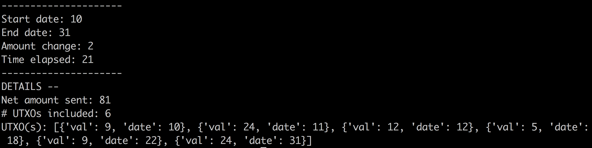
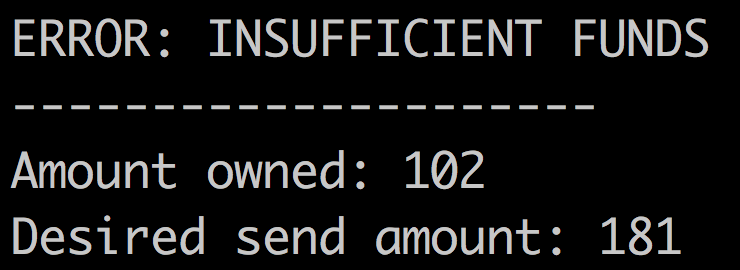

# Calculating Change from UTXOs
#### Summary
Algorithm is contained in `change.py`. Sample list of UTXOs (containing values and arbitrary UTC dates) is in `utxos.py`. `tiebreaker.py` is code written in case I had to definitively break ties, but this isn't the case. In the case of a tie, I can simply select any of the tied candidates. The script is run from the end of the `change.py` file via the `find_range` function call, which takes in a list of UTXOs and a value (amount sent). By default, the desired send amount is 81, and the list of UTXOs is imported from the file `utxos.py`. 

Given the defaults, the image below shows what would be printed if this script were run via command line: start date, end date, amount change, time elapsed (aka end - start), net amount sent, # UTXOs included, and the list of included UTXOs. 

In the case that there are insufficient funds (i.e. if amount sent > amount possessed), the following would be printed: error message, amount owned, and amount sent.

#### Run-time
I initially thought that I would have to consider all possible combinations of UTXOs and find the combination that resulted in a sum closest to the amount sent (a la the subset sum problem). However, this was not the case. Because I only had to consider consecutive UTXOs, this made the problem simpler in terms of understanding and in terms of resulting run-time. 

Let's say there are `n` UTXOs. Consider a range starting with the first UTXO in the list. There are `n` ways to select consecutive UTXOs starting from this first index. If we prevent duplicates, from the second index, there are now `n - 1` ways to do so. This follows until the last UTXO in the list, and thus we have the sum `n + n - 1 + n - 2 + ... + 1 = n(n+1)/2 = O(n^2)`. I use a sorting algorithm toward the end of my function in order to sort by least amount of change. However, Python's Timsort has a run-time of `O(nlogn)`, which gets absorbed and we're still left with `O(n^2)`.
